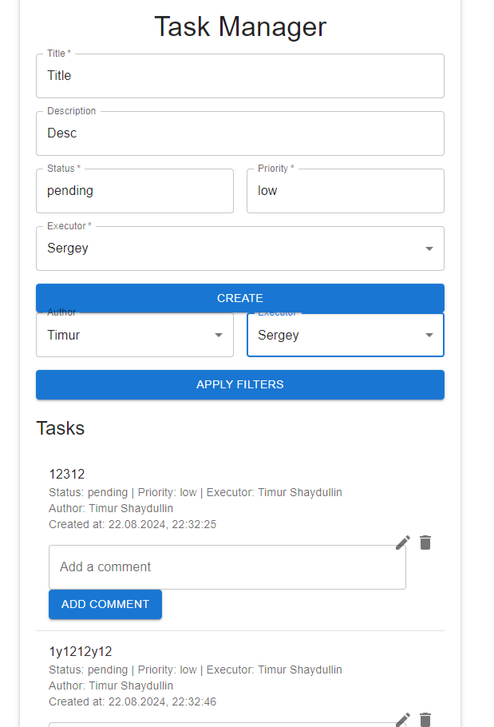
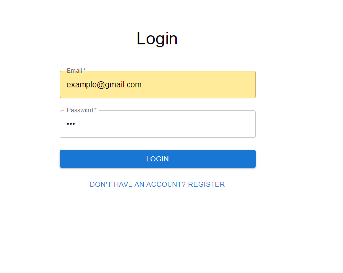
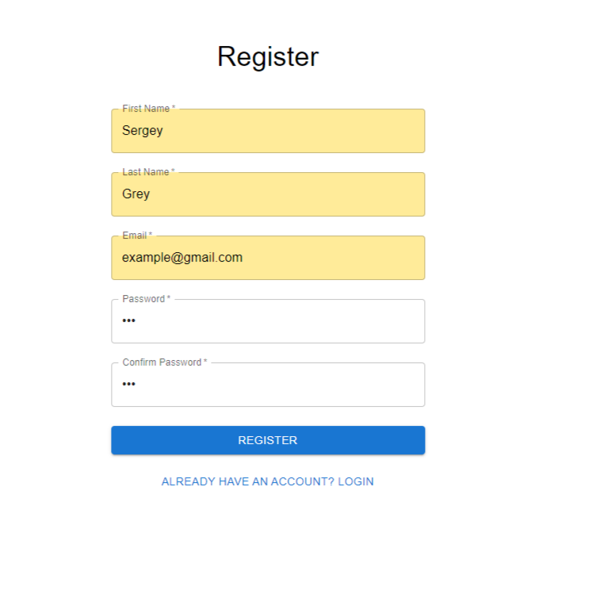
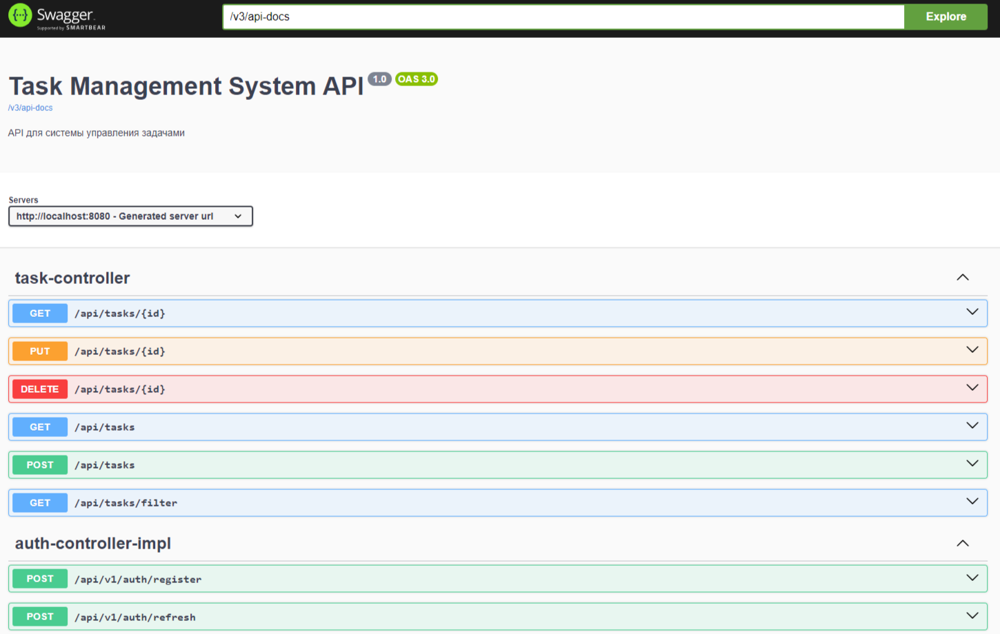

# Система управления задачами (Task Management System)

## Обзор
Система управления задачами — это простое API-приложение для управления задачами,
разработанное для демонстрации ключевых концепций, таких как аутентификация,
авторизация и основные операции CRUD. Система позволяет пользователям создавать,
редактировать, удалять и просматривать задачи, назначать задачи исполнителям,
а также оставлять комментарии. Она построена с использованием Java 17+, Spring Boot,
PostgreSQL и следует лучшим практикам в разработке REST API.

## Скриншоты

### Страница задач


### Страница логина


### Страница регистрации


### Страница swagger


## Основные возможности
- **Управление задачами**: Создание, редактирование, удаление и просмотр задач.
- **Аутентификация и авторизация**: Вход в систему с использованием email и пароля,
  аутентификация с помощью JWT токенов.
- **Роли пользователей**: Пользователи могут управлять своими задачами, просматривать
  задачи других пользователей и изменять статус задач, назначенных им в качестве исполнителей.
- **Комментарии к задачам**: Возможность оставлять комментарии к задачам.
- **Фильтрация и пагинация**: Получение задач конкретного автора или исполнителя, поддержка
  фильтрации и пагинации результатов.
- **Документация API**: API документировано с использованием Swagger/OpenAPI, предоставлен
  Swagger UI для тестирования.

## Стек технологий
- **Язык**: Java 17+
- **Фреймворк**: Spring Boot 3+
- **База данных**: PostgreSQL
- **Документация API**: Swagger/OpenAPI
- **Инструменты сборки**: Maven
- **Контейнеризация**: Docker, Docker Compose

## Установка и запуск

### Локальный запуск

#### Backend

1. **Клонирование репозитория**
   ```bash
   git clone https://github.com/IronTommy/task-management-system.git
   cd task-management-system
   ```

2. **Настройка базы данных**
    - Убедитесь, что PostgreSQL установлен и запущен на вашем компьютере.
    - Создайте базу данных и пользователя с правами доступа:
      ```sql
      CREATE DATABASE taskdb;
      CREATE USER taskuser WITH PASSWORD 'taskpass';
      GRANT ALL PRIVILEGES ON DATABASE taskdb TO taskuser;
      ```
    - Примените миграции базы данных с помощью Liquibase (это произойдет автоматически
      при запуске приложения).

3. **Настройка переменных среды**
    - Создайте файл `application.yml` в папке `src/main/resources` с необходимыми настройками:
      ```yaml
      spring:
      datasource:
      url: jdbc:postgresql://localhost:5432/taskdb
      username: taskuser
      password: taskpass
      driver-class-name: org.postgresql.Driver

      jpa:
      hibernate:
      ddl-auto: none
      properties:
      hibernate:
      dialect: org.hibernate.dialect.PostgreSQLDialect
      ```

4. **Сборка и запуск приложения**
   ```bash
   ./mvnw clean install
   ./mvnw spring-boot:run
   ```

5. **Запуск с использованием Docker**
    - **Клонирование репозитория**

      ```bash
      git clone https://github.com/IronTommy/task-management-system.git
      cd task-management-system
      ```

    - **Сборка и запуск контейнеров**

      ```bash
      docker-compose up --build
      ```

#### Frontend

1. **Клонирование репозитория**
   ```bash
   git clone https://github.com/IronTommy/task-management-frontend.git
   cd task-management-frontend
   ```

2. **Установка зависимостей**
   ```bash
   npm install
   # или если используете yarn
   yarn install
   ```

3. **Настройка**
    - Перед запуском убедитесь, что у вас есть настроенный бэкенд сервер. Обновите файл конфигурации `src/authFetch.js`, чтобы указать правильный URL бэкенда:
      ```javascript
      const API_URL = 'http://localhost:8080/api'; // Замените на URL вашего бэкенда
      ```

4. **Запуск проекта**
   ```bash
   npm start
   # или если используете yarn
   yarn start
   ```
   Это запустит проект в режиме разработки и откроет его в вашем браузере по адресу [http://localhost:3000](http://localhost:3000).

## Доступ к API

Swagger UI будет доступен по адресу: [http://localhost:8080/swagger-ui/index.html#/](http://localhost:8080/swagger-ui/index.html#/)

## Тестирование
Для запуска тестов выполните следующую команду:

```bash
./mvnw test
```

## Документация API
Полная документация API доступна через Swagger UI. Это позволяет разработчикам
просматривать, тестировать и документировать API с удобным веб-интерфейсом.

## Авторизация
Для аутентификации в системе используется JWT токен. Для получения токена выполните
запрос на эндпоинт `/api/v1/auth/login`, передав email и пароль в теле запроса. Полученный
токен нужно использовать для всех дальнейших запросов.

## Лицензия
Этот проект лицензирован под MIT License.
